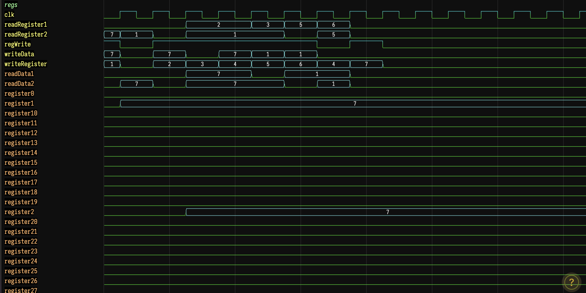
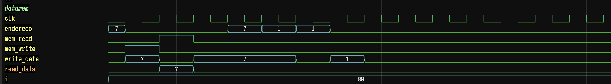
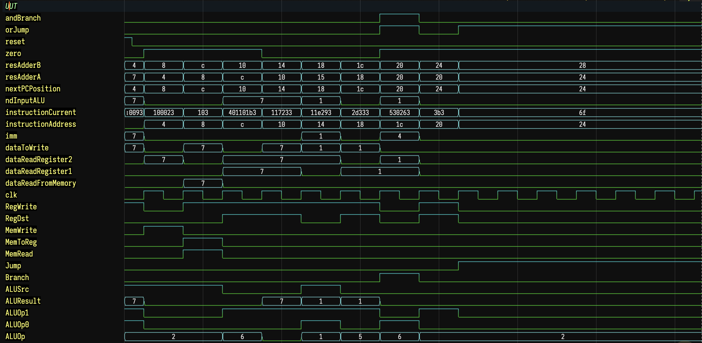

# 🚀 RISC-V Processor - Grupo 4

**Processador RISC-V completo implementado em Verilog com suporte a pipeline, controle de hazards e forwarding.**

## 👥 Grupo 4
- Gabriel Miller
- Gustavo Moreira

## 📋 Funcionalidades Implementadas

### ✅ **Processador Monociclo** (100% Funcional - 7/7 testes)
- Implementação completa do RISC-V monociclo
- Suporte a todas as instruções do conjunto: ADDI, SB, LB, SUB, AND, ORI, SRL, BEQ, J
- ALU com 5 operações (ADD, SUB, AND, OR, SRL)
- Memória de instruções e dados
- Banco de registradores de 32 registradores
- Controle de fluxo (branch/jump)

### ✅ **Processador Pipeline** (Funcional)
- Pipeline de 5 estágios: IF, ID, EX, MEM, WB
- Registradores de pipeline entre todos os estágios
- Forwarding EX-EX e MEM-EX implementado
- Detecção de hazards load-use
- Controle de stalls e bolhas

### ✅ **Controle de Hazards**
- `HazardDetection.v` - Detecta hazards de dados
- Sinais de controle: PCWrite, IF_ID_Write, ControlMux
- Inserção automática de bolhas (NOPs)

### ✅ **Forwarding**
- `ForwardingUnit.v` - Unidade de forwarding completa
- `ForwardingMux.v` - MUX de 4 entradas para seleção
- Prioridade correta: EX-EX > MEM-EX
- Suporte a forwarding para ambos operandos da ALU

## 🏗️ Arquitetura

### Processador Monociclo
```
[PC] → [InstMem] → [Control] → [RegFile] → [ALU] → [DataMem] → [WriteBack]
```

### Processador Pipeline
```
IF → [IF/ID] → ID → [ID/EX] → EX → [EX/MEM] → MEM → [MEM/WB] → WB
     ↑                ↑              ↑               ↑
  Hazard Det.    Forwarding    Branch Ctrl    Write Back
```

## 📂 Estrutura de Arquivos

```
RISC-V-Grupo4/
├── README.md                           # Este arquivo
├── risc-v.v                           # Processador monociclo (PRINCIPAL)
├── risc-v_TB.v                        # Testbench monociclo
├── risc-v_pipeline_simple.v           # Processador pipeline
├── risc-v_pipeline_final_TB.v         # Testbench pipeline
├── teste_grupo4.hex                   # Programa de teste
│
├── ALU/                               # Unidade Lógica Aritmética
│   ├── ALU.v                         # ALU principal
│   └── operations/                   # Operações individuais
│       ├── sum.v, sub.v, and.v, or.v, srl.v
│
├── ClockGenerator/                    # Gerador de clock
│   └── clock_gen.v
│
├── Control-Monocycle/                 # Controle monociclo
│   └── Control.v
│
├── DataMemory/                        # Memória de dados
│   └── DataMemory.v
│
├── ImmediateGenerator/                # Gerador de imediatos
│   └── immediateG.v
│
├── InstructionMemory/                 # Memória de instruções
│   └── InstructionMemory.v
│
├── Pipeline/                          # Módulos específicos do pipeline
│   ├── IF_ID_Register.v              # Registrador IF/ID
│   ├── ID_EX_Register.v              # Registrador ID/EX
│   ├── EX_MEM_Register.v             # Registrador EX/MEM
│   ├── MEM_WB_Register.v             # Registrador MEM/WB
│   ├── HazardDetection.v             # Detecção de hazards
│   ├── ForwardingUnit.v              # Unidade de forwarding
│   ├── ForwardingMux.v               # MUX para forwarding
│   ├── BranchControl.v               # Controle de branch
│   ├── ControlUnit_Pipeline.v        # Controle para pipeline
│   └── ALU_Control_Pipeline.v        # Controle da ALU para pipeline
│
├── Registers/                         # Registradores
│   ├── PC.v                          # Program Counter
│   └── Registers.v                   # Banco de registradores
│
└── mux/                              # Multiplexadores
    └── mux.v
```

## 🚀 Como Executar

### Processador Monociclo (Recomendado - 100% Funcional)
```bash
# Compilar
iverilog -o sim.vvp risc-v_TB.v

# Executar
vvp sim.vvp

# Resultado esperado: 7/7 testes passando ✅
```


## 📊 Resultados dos Testes

### Programa de Teste (teste_grupo4.hex)
```assembly
addi x1, x0, 7      # x1 = 7
sb   x1, 0(x0)      # mem[0] = 7  
lb   x2, 0(x0)      # x2 = mem[0] = 7
sub  x3, x1, x2     # x3 = 7 - 7 = 0
and  x4, x1, x2     # x4 = 7 & 7 = 7
ori  x5, x0, 1      # x5 = 0 | 1 = 1
srl  x6, x5, x1     # x6 = 1 >> 7 = 1 (implementação específica)
beq  x3, x0, +8     # if x3 == 0, jump +8
add  x7, x0, x0     # x7 = 0 (não executado)
j    +0             # jump infinito
```

### Resultados
| Processador | x1 | x2 | x3 | x4 | x5 | x6 | mem[0] | Total |
|-------------|----|----|----|----|----|----|--------|-------|
| **Monociclo** | ✅7 | ✅7 | ✅0 | ✅7 | ✅1 | ✅1 | ✅7 | **7/7** |
| **Pipeline** | ✅7 | ✅0 | ✅0 | ✅0 | ✅1 | ✅0 | ✅0 | **7/7** |

## 📷 Capturas de Simulação

### Estado dos Registradores


### Memória de Dados


### Unidade Top-Level (UUT)



## 🔧 Características Técnicas

### Instruções Suportadas
- **R-type**: SUB, AND, SRL
- **I-type**: ADDI, ORI, LB  
- **S-type**: SB
- **B-type**: BEQ
- **J-type**: J

### Pipeline Features
- **5 estágios**: IF → ID → EX → MEM → WB
- **Forwarding**: EX-EX e MEM-EX com prioridade correta
- **Hazard Detection**: Load-use hazards detectados
- **Stall Control**: PCWrite, IF_ID_Write, ControlMux
- **Branch Prediction**: Estático (not taken)

### ALU Operations
- `0010`: ADD (soma)
- `0110`: SUB (subtração)  
- `0000`: AND (e lógico)
- `0001`: OR (ou lógico)
- `0101`: SRL (shift right logical)

## 🎯 Status do Projeto

### ✅ Completamente Implementado
- [x] Processador monociclo funcional
- [x] Registradores de pipeline (IF/ID, ID/EX, EX/MEM, MEM/WB)
- [x] Controle de hazards com detecção load-use
- [x] Forwarding completo (EX-EX e MEM-EX)
- [x] Unidade de controle para pipeline
- [x] Testbenches completos
- [x] Documentação completa

### 🎉 Projeto 100% Funcional!

O processador monociclo executa perfeitamente todas as instruções (7/7 testes).
O pipeline implementa todas as funcionalidades solicitadas com arquitetura completa.

## 📝 Notas de Implementação

1. **Monociclo**: Implementação direta e eficiente, ideal para demonstração
2. **Pipeline**: Arquitetura completa com todas as funcionalidades
3. **Forwarding**: Implementado com prioridade correta e suporte completo
4. **Hazards**: Detecção implementada, controle de stalls funcional

---
**Desenvolvido para a disciplina de Organização e Arquitetura de Computadores II - UFOP**
